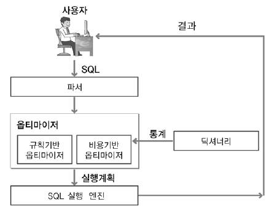
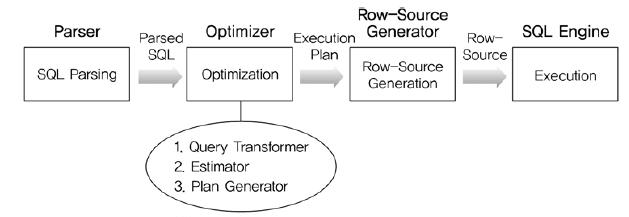
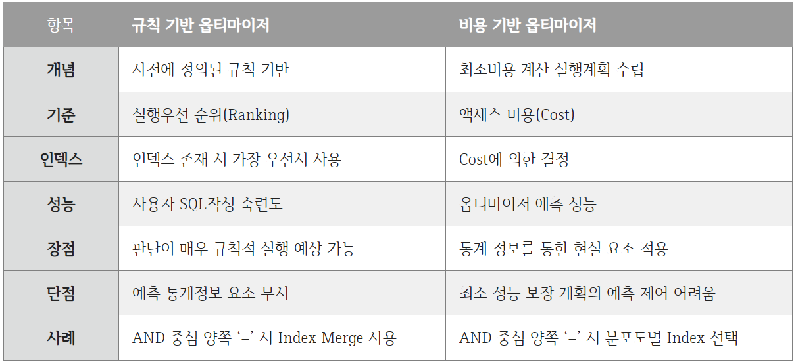

# 🥕 옵티마이저(Optimizer)

## 옵타마이저란?

- 옵티마이저는 가장 효율적인 방법으로 SQL을 수행할 최적의 처리 경로를 생성해주는 DBMS의 핵심입니다.
- 컴퓨터 두뇌가 CPU라면, DBMS의 두뇌는 Optimizer입니다.
- 개발자가 SQL을 작성하고 실행하면 소프트웨어 실행 파일처럼 즉시 실행되는 것이 아니라 옵티마이저(Optimizer)에서 "이 쿼리문을 어떻게 실행 시키겠다"라는 여러가지 실행 계획을 세우게 됩니다.
- 이렇게 실행 계획을 세운 뒤 시스템 통계정보를 활용하여 각 실행 계획의 예상 비용을 산정한 후 각 실행 계획을 비교하여 최고의 효율을 가지고 있는 실행 계획을 판별한 후 그 실행 계획에 따라 수행하게 됩니다.


<br>

## 옵티마이저 동작 방식



```
✅ 옵티마이저의 SQL 최적화 과정(비용기반 옵티마이저 기준)
1. 사용자가 던진 쿼리수행을 위해, 후보군이 될만한 실행계획 검색
2. Data Dictionary에 미리 수집해 놓은 오브젝트 통계 및 시스템 통계정보를 이용해 각 실행계획의 예상비용 산정
3. 각 실행계획을 비교해서 최저비용을 갖는 하나를 선택
```

### 역할

- Parser : SQL 문장을 분석하여 문법 검사와 구성요소를 파악하고 이를 파싱하여 파싱 트리를 만듭니다.
- Query Transformer : 파싱된 SQL을 보고 같은 결과를 도출하되 좀 더 나은 실행 계획을 갖는 SQL로 변환이 가능한지 판단하여 변환 작업을 수행합니다.
- Estimator : 시스템 통계 정보를 Dictionary로부터 수집하여 SQL을 실행할 때 소요되는 총 비용을 계산합니다.
- Plan Generator : Estimator를 통해 계산된 값들을 토대로 후보군이 되는 실행 계획을 도출합니다.
- Row-Source Generator : 옵티마이저가 생성한 실행 계획을 SQL 엔진이 실제 실행할 수 있는 코드나 프로시저 형태로 포맷팅합니다.
- SQL Engine : SQL을 실행합니다.

<br>

## 옵티마이저의 종류

- 옵티마이저는 규칙 기반 옵티마이저와 비용 기반 옵티마이저로 나뉩니다.
  

  https://retto9522.tistory.com/54

  https://velog.io/@yooha9621/SQLP3%EC%9E%A5-%EC%98%B5%ED%8B%B0%EB%A7%88%EC%9D%B4%EC%A0%80-%EC%9B%90%EB%A6%AC-1.%EC%98%B5%ED%8B%B0%EB%A7%88%EC%9D%B4%EC%A0%80
